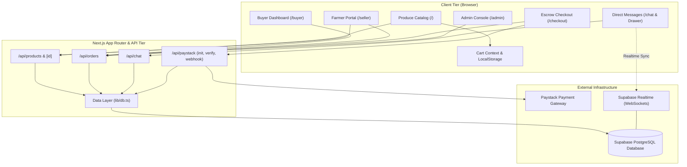
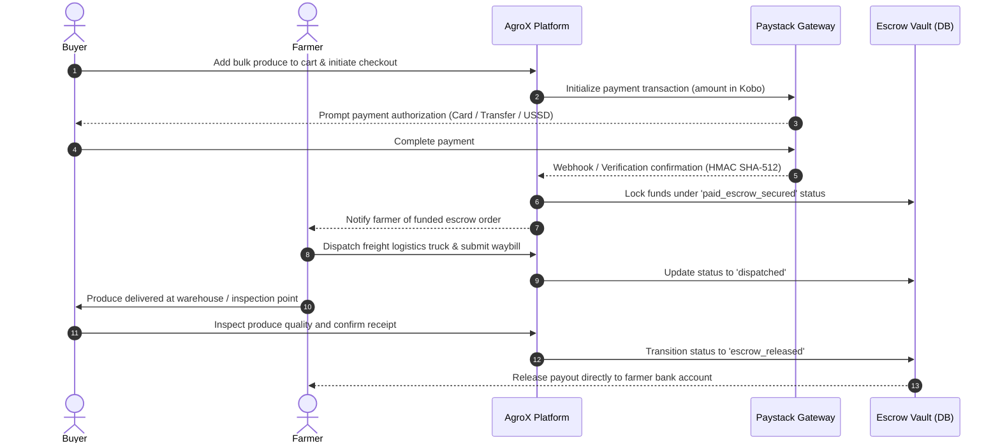
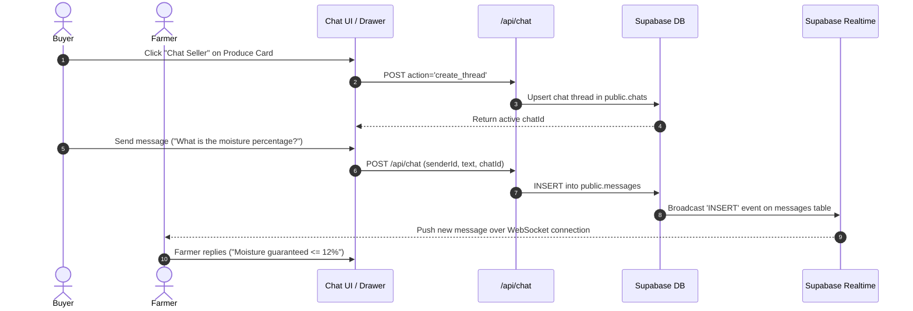
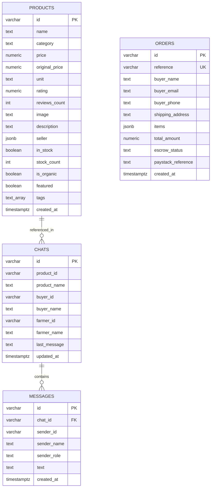

# AgroX — B2B Agricultural Produce & Escrow Marketplace

**AgroX is a business-to-business agricultural marketplace that lets bulk buyers purchase
produce directly from verified farmers, with payment held in escrow until delivery is
confirmed.**

---

## 📖 About the Project

### The problem

Agricultural trade in Nigeria is dominated by intermediaries, largely because buyers and
sellers who have never dealt with one another have no basis for trusting each other with
money. A farmer will not ship a lorry of maize before being paid; a processor will not wire
₦2 million to a stranger before seeing the goods. Middlemen bridge that trust gap, and take
a margin from both sides for doing so.

### The approach

AgroX removes the need for that intermediary by holding the money itself. A buyer's payment
is captured up front through Paystack and recorded against the order, but it is not treated
as the seller's until the produce has been dispatched, delivered and signed off. Every
order moves through an explicit escrow lifecycle, and the platform arbitrates when something
goes wrong — including issuing full or partial refunds.

The result is a marketplace where a first-time buyer and a first-time seller can transact
safely without knowing each other.

### Who uses it

| Role | What they do |
|---|---|
| **Buyers** — processors, retailers, institutional kitchens | Browse produce by category, negotiate with farmers, pay into escrow, track orders to delivery |
| **Farmers / suppliers** | List produce with pricing, packaging and stock, respond to buyer enquiries, fulfil orders |
| **Platform administrators** | List produce on the platform's own behalf, oversee every order, advance escrow states, issue refunds, answer support |

### What it does

- **Produce catalogue** — search and category filtering, organic and discount indicators, stock awareness
- **Escrow checkout** — Paystack payment with server-side pricing, verified against the processor before any order is marked paid
- **Order lifecycle** — eight explicit states from `pending` through to `escrow_released` or `refunded`
- **Refunds** — full and partial, issued against the payment processor and reconciled by webhook
- **Negotiation & support messaging** — buyer-to-farmer conversations, plus a support channel to the platform
- **Administrative console** — password-protected; product management with image upload, order oversight, refund queue and a support inbox
- **First-party listings** — the platform can sell directly alongside farmers under its own verified identity

### Design principles

Two commitments shape the implementation and are worth stating plainly:

1. **The database is the only source of truth.** The application ships no sample catalogue
   and no placeholder records. If the database is unreachable, endpoints return
   `503 DATABASE_UNAVAILABLE` with the reason — an empty catalogue means the catalogue is
   empty, never that the system quietly substituted invented data.

2. **Money is never assumed.** An order is created *unpaid* and only becomes
   `paid_escrow_secured` when Paystack independently confirms the transaction for the
   correct amount and currency. Abandoning checkout, a network failure, or a declined
   payment all leave the order unpaid. Payment confirmations are idempotent, so the
   browser callback and the asynchronous webhook cannot double-apply.

---

## 📑 Table of Contents
1. [About the Project](#-about-the-project)
2. [System Architecture](#-system-architecture)
3. [Order & Escrow Lifecycle](#-order--escrow-lifecycle)
4. [Chat & Negotiation Flow](#-chat--negotiation-flow)
5. [Database Entity-Relationship (ER) Model](#-database-entity-relationship-er-model)
6. [Directory Structure](#-directory-structure)
7. [Pages & Application Modules](#-pages--application-modules)
8. [Components & UI Elements](#-components--ui-elements)
9. [Backend & API Endpoints](#-backend--api-endpoints)
10. [State Management & Contexts](#-state-management--contexts)
11. [Database Schema & Realtime Setup](#-database-schema--realtime-setup)
12. [Environment Variables](#-environment-variables)
13. [Getting Started Locally](#-getting-started-locally)
14. [Admin Console](#-admin-console)
15. [Security & Best Practices](#-security--best-practices)

---

## 🧱 Tech Stack

| Layer | Technology |
|---|---|
| Framework | Next.js 16.3 (App Router) |
| Language | TypeScript 5.6 |
| UI | React 18.3, Lucide icons |
| Styling | Hand-rolled CSS design system (design tokens + `agrox-*` utilities) |
| Database | PostgreSQL via Supabase, with Row Level Security |
| Storage | Supabase Storage (product imagery) |
| Payments | Paystack (cards, bank transfer, USSD, mobile money) |

---

## 🏛 System Architecture

The following diagram illustrates the relationship between the Next.js frontend, server-side route handlers, PostgreSQL via Supabase, and the Paystack payment infrastructure.



---

## 🔒 Order & Escrow Lifecycle

AgroX protects buyers and farmers from fraud through a multi-stage escrow protocol:



---

## 💬 Chat & Negotiation Flow

Buyers and farmers can negotiate bulk discounts, moisture levels, and logistics delivery timelines in real-time.



---

## 🗄 Database Entity-Relationship (ER) Model



---

## 📂 Directory Structure

```plaintext
agricX/
├── app/                              # Next.js App Router
│   ├── admin/                        # Admin console (password protected)
│   │   ├── page.tsx                  # Products, orders, refunds, support
│   │   └── login/page.tsx            # Authentication screen
│   ├── api/                          # REST API Handlers
│   │   ├── admin/                    # Admin-only, gated by proxy.ts
│   │   │   ├── session/route.ts      # Login / logout
│   │   │   ├── products/             # Listing CRUD
│   │   │   ├── orders/route.ts       # Oversight & escrow transitions
│   │   │   ├── refunds/route.ts      # Refund issue & reconciliation
│   │   │   ├── chats/route.ts        # Support inbox
│   │   │   ├── upload/route.ts       # Product image upload
│   │   │   └── diagnostics/route.ts  # Environment self-report
│   │   ├── chat/route.ts             # Direct messaging & threads
│   │   ├── orders/route.ts           # Order creation & retrieval
│   │   ├── paystack/
│   │   │   ├── initialize/route.ts   # Paystack checkout transaction init
│   │   │   ├── verify/route.ts       # Payment verification endpoint
│   │   │   └── webhook/route.ts      # HMAC-verified webhook handler
│   │   └── products/
│   │       ├── route.ts              # Produce catalogue query & insertion
│   │       └── [id]/route.ts         # Single produce retrieval
│   ├── buyer/                        # Buyer Command Center
│   │   └── page.tsx
│   ├── chat/                         # Full-screen Chat Inbox
│   │   └── page.tsx
│   ├── checkout/                     # Escrow Checkout & Payment Gateway
│   │   └── page.tsx
│   ├── seller/                       # Farmer Portal & Inventory Listing
│   │   └── page.tsx
│   ├── globals.css                   # Design tokens, typography & utilities
│   ├── layout.tsx                    # Root layout with CartProvider
│   └── page.tsx                      # Marketplace Home & Produce Catalog
├── components/                       # Reusable React UI Components
│   ├── cart/
│   │   └── CartDrawer.tsx            # Slide-over cart with totals & checkout CTA
│   ├── chat/
│   │   ├── ChatDrawer.tsx            # Slide-over direct messaging drawer
│   │   └── ChatWindow.tsx            # Live message list & input composer
│   ├── home/
│   │   ├── CategoryStrip.tsx         # Filterable category pills strip
│   │   ├── HeroBanner.tsx            # High-impact marketplace hero banner
│   │   └── ProductGrid.tsx           # Grid layout for produce cards
│   ├── layout/
│   │   ├── Navbar.tsx                # Sticky glass navbar with search & cart
│   │   └── Footer.tsx                # Corporate footer with platform links
│   ├── products/
│   │   ├── ProductCard.tsx           # Produce card with price, unit & seller
│   │   └── ProductDetailsModal.tsx   # Detailed modal with moisture/origin specs
│   └── ui/
│       └── Toast.tsx                 # Notification toast component
├── context/
│   └── CartContext.tsx               # Cart state, persistence & toast triggers
├── lib/
│   ├── data.ts                       # Verified seed produce dataset
│   ├── db.ts                         # Database queries with memory fallback
│   ├── supabase.ts                   # Supabase client & WebSocket initialization
│   └── utils.ts                      # Nigerian Naira (₦) currency formatting
├── types/
│   └── index.ts                      # Strict TypeScript models & interfaces
├── supabase-schema.sql               # Production database schema, indexes & RLS
├── next.config.js                    # Next.js configuration
├── package.json                      # Dependencies & scripts
└── tsconfig.json                     # TypeScript compiler configuration
```

---

## 🖥 Pages & Application Modules

| Route | Module Name | Description & Functional Responsibility |
| :--- | :--- | :--- |
| **`/`** | **Marketplace Catalog** | Public produce storefront with category filtering, search, quick view details modal, and hero banner. |
| **`/buyer`** | **Buyer Command Center** | Dashboard for procurement managers to track active escrow orders, fulfillment milestones, and chat with farmers. |
| **`/seller`** | **Farmer Portal** | Portal for verified farmers to publish produce harvests, track revenue in escrow, and manage order dispatches. |
| **`/checkout`** | **Escrow Checkout** | Multi-item checkout form integrated with Paystack inline/redirect payments and simulated sandbox testing. |
| **`/chat`** | **Direct Message Inbox** | Full-page conversation interface displaying active buyer-farmer negotiation threads and platform support conversations. |
| **`/admin`** | **Admin Console** | Password-protected console: product listing management with image upload, platform-wide order oversight and escrow transitions, refund issue and reconciliation, and a support inbox. |
| **`/admin/login`** | **Admin Authentication** | Signed-cookie login, rate limited, failing closed when unconfigured. |

---

## 🧩 Components & UI Elements

### 1. Navigation & Layout
* **`Navbar`** (`components/layout/Navbar.tsx`): Sticky glassmorphism header featuring AgroX branding, produce search bar, quick links to Buyer & Farmer portals, real-time message notification triggers, and the shopping cart badge.
* **`Footer`** (`components/layout/Footer.tsx`): Platform footer detailing escrow safety policies, agricultural categories, accreditation info, and contact channels.

### 2. Marketplace & Produce Display
* **`HeroBanner`** (`components/home/HeroBanner.tsx`): High-conversion hero showcasing platform value propositions (100% Escrow Secured, Verified Farm Produce, Direct Sourcing).
* **`CategoryStrip`** (`components/home/CategoryStrip.tsx`): Sticky horizontal pill selector allowing instant produce filtering across categories like *Grains & Cereals*, *Fresh Produce*, *Seeds*, and *Farm Equipment*.
* **`ProductGrid`** (`components/home/ProductGrid.tsx`): Responsive CSS grid that dynamically renders filtered produce collections.
* **`ProductCard`** (`components/products/ProductCard.tsx`): Produce presentation unit displaying harvest photography, seller badges, pricing per unit packaging, rating stars, and one-click add to cart.
* **`ProductDetailsModal`** (`components/products/ProductDetailsModal.tsx`): Detailed overlay providing origin specifications, moisture level warranties, stock count, and direct seller chat action.

### 3. Shopping Cart & Messaging
* **`CartDrawer`** (`components/cart/CartDrawer.tsx`): Slide-over drawer with item quantity modification, total Naira calculation, item removal, and instant checkout forwarding.
* **`ChatDrawer`** (`components/chat/ChatDrawer.tsx`): Contextual slide-over drawer enabling instant negotiation without leaving the current catalog page.
* **`ChatWindow`** (`components/chat/ChatWindow.tsx`): Message thread renderer with role differentiation (farmer vs. buyer bubbles), timestamps, and auto-scroll.
* **`Toast`** (`components/ui/Toast.tsx`): Bottom-right animated notification for cart additions and system events.

---

## ⚡ Backend & API Endpoints

### 1. Products (`/api/products`)
* **`GET /api/products`**: Returns an array of produce items. Accepts optional query parameters: `category` and `search`.
* **`POST /api/products`**: Inserts a new produce listing into the catalog with seller validation and inventory counts.
* **`GET /api/products/[id]`**: Retrieves specific harvest and pricing details for a single produce item.

### 2. Orders & Escrow (`/api/orders`)
* **`GET /api/orders`**: Retrieves orders filtered by `buyerEmail` or `farmerId`.
* **`POST /api/orders`**: Generates a new order with a collision-resistant reference (`AGX-xxxxxx-HEX`) and locks status to `paid_escrow_secured`.

### 3. Payment Processing (`/api/paystack/...`)
* **`POST /api/paystack/initialize`**: Converts order totals to Kobo (`NGN * 100`) and calls Paystack's transaction initialization API, returning the `authorization_url`. Includes a zero-config sandbox simulator when keys are omitted.
* **`POST /api/paystack/verify`**: Verifies transaction status with Paystack and updates the order's escrow status in the database.
* **`POST /api/paystack/webhook`**: Server-to-server webhook endpoint verifying the `x-paystack-signature` header via **HMAC SHA-512** to process background transaction confirmations.

### 4. Messaging & Negotiations (`/api/chat`)
* **`GET /api/chat?action=threads`**: Fetches all active chat threads for a user.
* **`GET /api/chat?chatId={id}`**: Fetches historical chronological messages for a specific chat.
* **`POST /api/chat`**: Dispatches a new message or creates a negotiation thread linked to a specific produce ID.

---

## 🔄 State Management & Contexts

* **`CartContext`** (`context/CartContext.tsx`):
  * Manages global shopping cart items, item quantity increments, item removals, and total amount calculation.
  * Persists shopping cart state locally in `localStorage` under the key `agrox_cart`.
  * Exposes `useCart()` hook for components to access cart operations and trigger notification toasts.

---

## 🗃 Database Schema & Realtime Setup

To initialize the Supabase PostgreSQL database:

1. Open your **Supabase Project Dashboard** → **SQL Editor**.
2. Run the SQL script found in [`supabase-schema.sql`](file:///c:/Users/HP/Desktop/projects/agricX/supabase-schema.sql).

### Key Schema Optimizations:
* **B-Tree Indexes**:
  * `idx_orders_buyer_email` & `idx_orders_reference` for sub-millisecond order lookups.
  * `idx_messages_chat_id_created` for ordered message retrieval.
  * `idx_products_category` & `idx_products_in_stock` for marketplace filtering.
* **Row Level Security (RLS)**: Enabled on every table. `products`, `orders`, `chats` and `messages` carry permissive policies (the API routes enforce access, since there is no end-user auth yet); `refunds` and `processed_webhook_events` have **no** policies at all and are reachable only via the service-role key.
* **Re-runnable**: `supabase-schema.sql` is the single source of truth and is safe to apply repeatedly. `npm run setup-db` reads and executes it.
* **Realtime Publication**: Automatically enables WebSocket event broadcast on `public.messages` and `public.chats`.

---

## 🔑 Environment Variables

Create a `.env.local` file in the project root with the following variables:

```env
# Supabase Configuration
NEXT_PUBLIC_SUPABASE_URL=https://your-project.supabase.co

# Publishable (browser-safe) key. MUST be the sb_publishable_ / anon key.
# Never put a service-role or sb_secret_ key on a NEXT_PUBLIC_ variable: those
# are inlined into the client bundle by the compiler.
NEXT_PUBLIC_SUPABASE_PUBLIC_KEY=sb_publishable_...
NEXT_PUBLIC_SUPABASE_ANON_KEY=sb_publishable_...

# Server-only. Bypasses RLS; used by lib/supabase-admin.ts for the refunds
# table, webhook idempotency, and product-image uploads.
SUPABASE_SERVICE_ROLE_KEY=sb_secret_...

# Direct Postgres connection, used only by `npm run setup-db`.
DATABASE_URL=postgresql://...

# Admin console. Login fails closed if either is unset - an absent password
# never means "no password required".
ADMIN_PASSWORD=choose-a-strong-password
ADMIN_SESSION_SECRET=a-long-random-string

# Paystack Payment Gateway
NEXT_PUBLIC_PAYSTACK_PUBLIC_KEY=pk_test_...
PAYSTACK_SECRET_KEY=sk_test_...

# Optional: exercise checkout end-to-end without Paystack keys.
PAYSTACK_SANDBOX_MODE=true
```

### How payments behave per configuration

Payment routes have exactly three states, with no fallthrough between them:

| Configuration | Behaviour |
| --- | --- |
| Valid `sk_test_` / `sk_live_` secret | Live: real Paystack calls; failures surface as failures. |
| No valid key, `PAYSTACK_SANDBOX_MODE=true` | Sandbox: checkout completes, clearly labelled, no money moves. |
| Neither | Checkout returns **503** and says payments are not configured. |

A placeholder value such as `sk_test_placeholder_key` counts as *not configured* - the key's shape is validated, not merely its presence, so a junk key can never be mistaken for a live one.

> **Note**: Postgres is the only source of truth. There is no in-memory or mock fallback: if the database is unreachable, API routes return **503 `DATABASE_UNAVAILABLE`** with a specific message rather than serving placeholder data. An empty table renders as an empty catalogue, not as demo products.

---

## 🚀 Getting Started Locally

### Prerequisites
* **Node.js**: v18.17.0 or higher
* **npm** or **pnpm** or **yarn**

### Installation Steps

```bash
# 1. Clone the repository
git clone https://github.com/MarvDavid/AgroX.git
cd AgroX

# 2. Install project dependencies
npm install

# 3. Start the Next.js development server
npm run dev
```

Open [http://localhost:3000](http://localhost:3000) in your browser to explore the AgroX marketplace.

### Build & Production Test

```bash
# Run production build and type checking
npm run build

# Start production server
npm run start
```

---

## 🛠 Admin Console

The console at **`/admin`** is the platform operator's control surface. It is protected by
`proxy.ts` (Next.js 16's renamed middleware, running on the Node.js runtime) using a signed
`httpOnly` session cookie, and every admin route re-verifies that session itself rather than
trusting the gate alone.

Set `ADMIN_PASSWORD` and `ADMIN_SESSION_SECRET` in `.env.local`, restart, then sign in at
`/admin/login`. If either variable is unset, login **fails closed** — an absent password
never means "no password required".

| Tab | Capability |
|---|---|
| **Overview** | Escrow volume (funded orders only), order counts, awaiting-payment count, open refunds, support thread count |
| **Products** | Create, edit and delete listings; image upload or URL with live preview; stock and organic flags; seller attribution |
| **Orders** | Every order, filterable to platform-owned listings; advance escrow state (dispatch → deliver → release); issue refunds |
| **Refunds** | Refund queue with amounts, reasons, processor IDs and statuses; manual reconciliation |
| **Support** | Two-pane inbox for replying to buyer conversations as the platform |

### First-party listings

Listings created in the console are attributed by default to the platform's own
**AgroX Admin** seller identity and marked with an *Admin* badge on the storefront. The
composer can instead attribute a listing to any existing farmer; the `listed_by_admin` flag
records the provenance independently, and is snapshotted onto the order item at purchase so
the administrative order view still recognises it.

### Refunds

Refunds are issued against Paystack's refund API and reconciled through the
`refund.processed` webhook. Partial refunds are supported, with a running total capped at
the amount actually paid. Where no live Paystack key is configured, a refund is recorded
honestly as `manual_pending` — the system states that no money moved rather than implying
it did.

---

## 🛡 Security & Best Practices
* **Server-Only Secrets**: Paystack secret keys and the Supabase service-role key are read only inside route handlers, and the service-role client (`lib/supabase-admin.ts`) refuses to load in a browser bundle. Nothing secret is exposed through a `NEXT_PUBLIC_` variable.
* **Admin Gate**: `/admin` and `/api/admin/*` are gated by `proxy.ts` (Next 16's rename of middleware, Node runtime) using a signed, httpOnly session cookie. Each admin handler re-checks the session itself rather than trusting the proxy alone, and login is rate-limited with timing-safe comparisons.
* **Server-Side Pricing**: `POST /api/orders` accepts only `{productId, quantity}` and prices every line from the database, so a tampered client cannot set its own total.
* **Payment Verification**: An order becomes `paid_escrow_secured` only when Paystack confirms the transaction *and* the amount and currency match the stored order. Cancelling or erroring leaves it `pending`.
* **Cryptographic Signatures**: Webhook payloads are verified using HMAC-SHA512 with timing-safe comparisons. Without a configured secret the webhook refuses to process at all - it never accepts unsigned payloads.
* **Idempotency**: Payment transitions use a conditional update keyed on the current status, and webhook deliveries are de-duplicated by event id, so the verify call and a retried webhook cannot double-apply.
* **No Fabricated Data**: The app ships no mock catalogue, no seeded demo orders or conversations, and no invented seller/buyer personas. Everything rendered comes from Postgres; the farmer portal derives its identity from the sellers present in the products table.